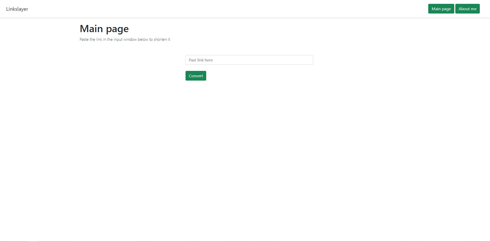
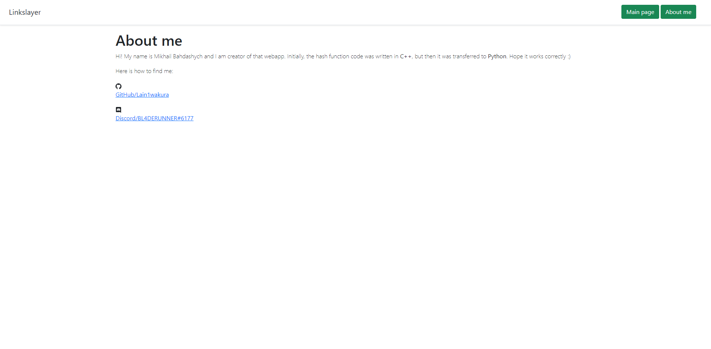
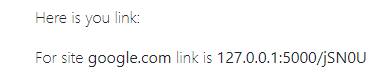

# LinkSlayer
Handmade web link cutter on Python + Flask

Here is simple HTML home page

This is about page

 Here is how you can cut you link (without http(s)://)  

And this is result  

Of course, this project has its drawbacks.
  1. The hash function is self-written, which means that there is a possibility of coalitions.
  2. The database saves the same links repeatedly

P.S. That is my first webapp, so I am glad it just works!
